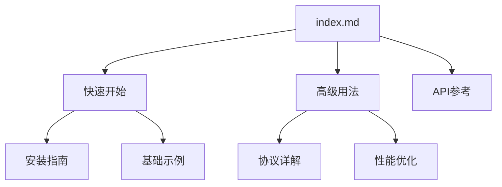

# ⚠️ 注意：本仓库为AI生成测试仓库

**此仓库内容由AI自动生成，仅用于测试目的，非实际项目。**

# MCP教程中心

## 项目概述

MCP(Message Control Protocol)是一个轻量级的消息控制协议，专为微服务通信和设备间消息传递设计。

## 主要功能

✔ 高效的消息传输  
✔ 支持多种数据格式  
✔ 可配置的压缩和加密  
✔ 完善的心跳和重连机制  

## 快速导航

- [快速开始](getting-started.md) - 基础安装和使用指南
- [高级用法](advanced.md) - 协议详解和性能优化
- [API参考](api.md) - 完整接口文档
- [示例代码](../examples) - 实用代码片段

## 文档结构

## 贡献指南

欢迎通过Issue或Pull Request参与项目贡献。

## 许可证

本项目采用MIT开源许可证。